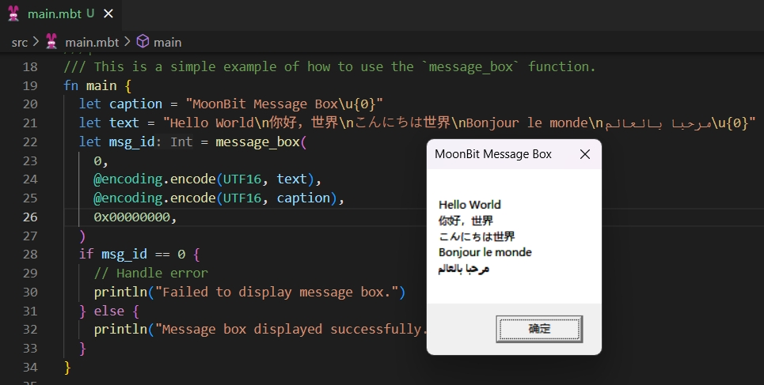

# win32_messagebox

[](https://github.com/justjavac/moonbit_ffi_win32_messagebox/actions/workflows/ci.yml)
[](https://codecov.io/gh/justjavac/moonbit_ffi_win32_messagebox)

A MoonBit native FFI demo for calling the Windows `MessageBoxW` API.



## Install

```sh
moon add justjavac/win32_messagebox
```

## Usage

This package is a native-only demo executable. On Windows, run:

```sh
moon run src --target native
```

The package exports a direct `MessageBoxW` binding:

```mbt nocheck
let result = message_box(
  0,
  @ffi.to_wstr("Hello from MoonBit"),
  @ffi.to_wstr("MoonBit Message Box"),
  0x00000000,
)
```

`MessageBoxW` expects UTF-16 strings. Convert MoonBit strings with
`@ffi.to_wstr` before passing them to `message_box`.

## Platform

The package is configured for the MoonBit `native` target and links against
Windows `user32.lib`. It can be type-checked on other operating systems, but the
demo can only run where the Win32 User32 API and linker library are available.

## License

MIT
